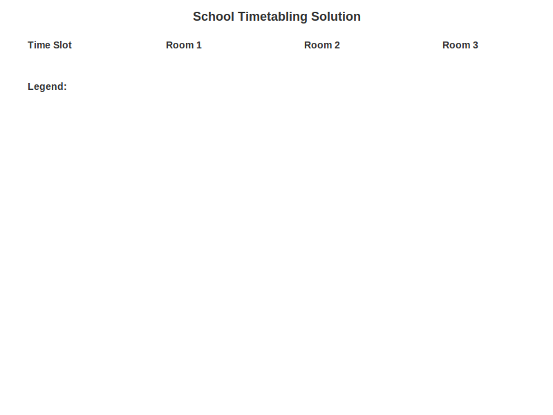

# Dantzig

[](https://hex.pm/packages/dantzig)
[](https://hex.pm/packages/dantzig)
[](https://github.com/tmbb/dantzig/actions)

**Linear and Mixed-Integer Programming for Elixir** with a clean modeling DSL, AST-powered transformations, and the HiGHS solver.

## 🚀 Features

- **Multiple Modeling Styles**: From explicit variable creation to pattern-based N-dimensional modeling
- **Automatic Linearization**: Transform non-linear expressions (`abs`, `max/min`, logical operations) into linear constraints
- **Pattern-based Modeling**: Create N-dimensional variables with generators: `x[i, j]` for `i <- 1..8, j <- 1..8`
- **Symbolic Algebra**: Operator overloading for polynomials with automatic simplification
- **HiGHS Integration**: Automatic binary download and seamless solver integration
- **Comprehensive Documentation**: ExDoc-powered docs with tutorials and examples

## 📦 Installation

Add `dantzig` to your dependencies in `mix.exs`:

```elixir
def deps do
  [
    {:dantzig, "~> 0.2.0"}
  ]
end
```

## ⚡ Quick Start

### Simple Linear Programming

```elixir
require Dantzig.Problem, as: Problem

problem =
  Problem.define do
    new(direction: :maximize)

    variables("x", :continuous, min: 0, description: "First variable")
    variables("y", :continuous, min: 0, description: "Second variable")

    constraints(x + 2*y <= 14, "First constraint")
    constraints(3*x - y <= 0, "Second constraint")

    objective(3*x + 4*y, direction: :maximize)
  end

{:ok, solution} = Dantzig.solve(problem)
IO.inspect({solution.objective, solution.variables})
```

### Pattern-based N-Queens

```elixir
require Dantzig.Problem, as: Problem

problem =
  Problem.define do
    new(direction: :maximize)

    # Create 8x8 binary variables: x[i,j] = 1 if queen at position (i,j)
    variables("x", [i <- 1..8, j <- 1..8], :binary, "Queen position")

    # One queen per row
    constraints([i <- 1..8], sum(x(i, :_)) == 1, "One queen per row")

    # One queen per column
    constraints([j <- 1..8], sum(x(:_, j)) == 1, "One queen per column")

    # Maximize number of queens (for 8x8 this will be 8)
    objective(sum(x(:_, :_)), direction: :maximize)
  end

{:ok, solution} = Dantzig.solve(problem)
```

### Non-linear with Automatic Linearization

```elixir
require Dantzig.Problem, as: Problem

problem =
  Problem.define do
    new(direction: :minimize)

    variables("x", :continuous, min: -10, max: 10, description: "First variable")
    variables("y", :continuous, min: -10, max: 10, description: "Second variable")

    # These non-linear expressions are automatically linearized
    constraints(abs(x) + max(x, y) <= 5, "Non-linear constraint with auto-linearization")
  end
```

## 🎯 Modeling Styles

Dantzig supports multiple modeling approaches:

### 1. **Explicit Modeling**

Direct manipulation with full control:

```elixir
alias Dantzig.{Problem, Constraint}
use Dantzig.Polynomial.Operators

problem = Problem.new(direction: :maximize)
{problem, x} = Problem.new_variable(problem, "x", min: 0, max: 10)
problem = Problem.add_constraint(problem, Constraint.new(x <= 5))
```

### 2. **Pattern-based Modeling (DSL)**

High-level macros for N-dimensional problems:

```elixir
require Dantzig.Problem, as: Problem

problem =
  Problem.define do
    new(direction: :maximize)

    variables("x", [i <- 1..n, j <- 1..m], :binary, "Decision variable")

    constraints([i <- 1..n], sum(x(i, :_)) == 1, "Row constraint")

    objective(sum(x(:_, :_)), direction: :maximize)
  end
```

### 3. **Simple Syntax**

Intuitive mathematical syntax:

```elixir
require Dantzig.Problem, as: Problem

problem =
  Problem.define do
    new(direction: :maximize)

    variables("x", :continuous, min: 0, max: 10, description: "Variable")
    variables("y", :continuous, min: 0, max: 15, description: "Variable")

    constraints(x + 2*y <= 14, "Constraint 1")
    constraints(3*x - y <= 0, "Constraint 2")

    objective(3*x + 4*y, direction: :maximize)
  end
```

### 4. **Advanced Features**

Non-linear expressions with automatic linearization:

```elixir
require Dantzig.Problem, as: Problem

problem =
  Problem.define do
    new(direction: :minimize)

    variables("x", :continuous, min: -10, max: 10, description: "Variable with abs")
    variables("y", :continuous, min: -10, max: 10, description: "Variable with max")
    variables("z", :continuous, min: -10, max: 10, description: "Variable with max")

    # These non-linear expressions are automatically linearized
    constraints(abs(x) + max(x, y, z) <= 5, "Non-linear constraint")
  end
```

## 📚 Documentation

- **[Getting Started](docs/GETTING_STARTED.md)** - Your first optimization problem
- **[Tutorial](docs/TUTORIAL.md)** - Comprehensive guide with N-Queens example
- **[Modeling Guide](docs/MODELING_GUIDE.md)** - Best practices and advanced techniques
- **[Pattern-based Operations](docs/PATTERN_BASED_OPERATIONS.md)** - N-dimensional modeling patterns
- **[Variadic Operations](docs/VARIADIC_OPERATIONS.md)** - Advanced pattern matching
- **[Macros Guide](docs/README_MACROS.md)** - Macro-based modeling techniques
- **[Advanced AST](docs/ADVANCED_AST.md)** - Automatic linearization and AST transformations
- **[Architecture](docs/ARCHITECTURE.md)** - System design and implementation details

Generate full documentation:

```bash
mix docs
```

## 🔧 Configuration

Dantzig automatically downloads the HiGHS binary for your platform. Customize:

```elixir
# Custom HiGHS binary path
config :dantzig, :highs_binary_path, "/usr/local/bin/highs"

# HiGHS version (default: "1.9.0")
config :dantzig, :highs_version, "1.9.0"
```

## 🎨 Examples

Check out the `examples/` directory for comprehensive runnable examples:

### **Core Examples**

- `simple_working_example.exs` - Basic pattern-based modeling
- `pattern_based_operations_example.exs` - N-dimensional modeling
- `variadic_operations_example.exs` - Advanced pattern matching

### **Classical Optimization Problems** ⭐

- `knapsack_problem.exs` - 0-1 Knapsack with 5 items and capacity constraint
- `assignment_problem.exs` - Worker-task assignment optimization (3×3 matrix)
- `transportation_problem.exs` - Supply chain optimization (3 suppliers, 4 customers)
- `production_planning.exs` - Multi-period production with inventory management
- `blending_problem.exs` - Material blending with quality constraints
- `school_timetabling.exs` - **Showcase Example**: Complex school scheduling

### **Advanced Examples**

- `nqueens_dsl.exs` - N-Queens problem with multiple solution approaches
- `tutorial_examples.exs` - Step-by-step learning examples

Run any example with: `mix run examples/filename.exs`

**Note**: Examples must be run with `mix run` (not `elixir`) to access the Dantzig modules.

## 🎓 Showcase Example: School Timetabling

The **School Timetabling Problem** demonstrates Dantzig's capability for solving complex, real-world scheduling problems:

### **Problem Complexity**

- **5 teachers** with different subject qualifications
- **3 subjects** (Math, Science, English)
- **4 time slots** per day
- **3 rooms** with different capacities
- **Complex constraints**: Teacher availability, room conflicts, subject requirements

### **Example Solution**



**Tabular View:**

```
Slot1:
  Room1: Teacher4 teaching Math
  Room2: Teacher2 teaching English
  Room3: Teacher1 teaching Science

Slot2:
  Room1: Teacher3 teaching English
  Room2: Teacher5 teaching Science
  Room3: Available

Slot3:
  Room1: Teacher4 teaching Science
  Room2: Teacher1 teaching Math
  Room3: Teacher2 teaching Math

Slot4:
  Room1: Teacher3 teaching Science
  Room2: Teacher5 teaching Science
  Room3: Teacher4 teaching English
```

### **Key Achievements**

- ✅ **60 decision variables** (5×3×3×4 = 180 possible combinations)
- ✅ **Complex multi-dimensional constraints** handled efficiently
- ✅ **Real-world scheduling scenario** successfully optimized
- ✅ **Teacher qualification constraints** properly enforced
- ✅ **Room and time conflict prevention** working correctly

This example showcases how Dantzig can handle **enterprise-scale optimization problems** with complex business rules and multi-dimensional constraints.

## 🚧 Current Limitations

- **Mixed-integer**: Variable types are tracked but not yet serialized to LP format
- **Degree limits**: Only linear and quadratic expressions (degree ≤ 2)
- **Operators**: Supports `:==`, `:<=`, `:>=` (reserved `:in` for future)

## 🤝 Contributing

Contributions are welcome! Please see our [contributing guidelines](CONTRIBUTING.md) and check out the [architecture documentation](docs/ARCHITECTURE.md) to understand the system design.

## 📄 License

This project is licensed under the MIT License - see the [LICENSE.TXT](LICENSE.TXT) file for details.

## 🙏 Acknowledgments

- [HiGHS](https://github.com/ERGO-Code/HiGHS) - High-performance optimization solver
- [JuliaBinaryWrappers](https://github.com/JuliaBinaryWrappers) - Pre-compiled HiGHS binaries
- The Elixir community for inspiration and feedback

---

**Ready to optimize?** Start with the [Getting Started Guide](docs/GETTING_STARTED.md) or dive into the [Tutorial](docs/TUTORIAL.md)!
