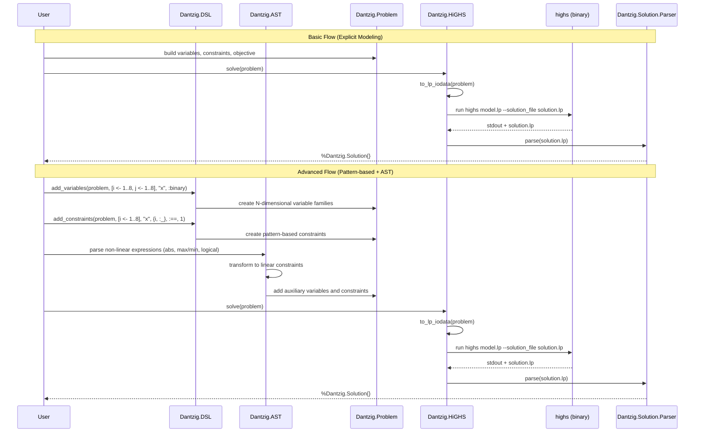

# Dantzig Architecture

Dantzig is a modeling layer for optimization problems in Elixir with a bridge to the external HiGHS solver. It provides multiple levels of abstraction: from low-level polynomial manipulation to high-level pattern-based modeling with automatic linearization of non-linear expressions. The syntax is designed to be declarative and concise. It is largely inspired by the Julia JuMP mathematical programming environment (<https://jump.dev/>).

## Key properties

- LP and QP (degree ≤ 2). Higher degrees raise during serialization
- Variables support bounds; `:type` exists but integer serialization is not yet implemented
- Constraints normalized automatically; symbolic solving helper for a variable
- Pattern-based modeling with N-dimensional variables and generators
- AST-powered automatic linearization of non-linear expressions (abs, max/min, logical operations)
- Multiple modeling styles: explicit, implicit, and macro-based

## Architecture Layers

### 1. Public API Layer

- `Dantzig` (public API)
  - `solve/1`, `solve!/1` – run HiGHS and return `Dantzig.Solution`
  - `dump_problem_to_file/2` – write LP/QP text model

### 2. Core Modeling Layer

- `Dantzig.Problem`
  - Holds `:direction`, `:objective`, `:variable_defs`, `:variables`, `:constraints`
  - Variable creation; constraint addition; objective helpers
  - Supports both scalar and N-dimensional variable families
- `Dantzig.ProblemVariable`
  - Struct with `:name`, `:min`, `:max`, `:type` fields
  - Variable bounds and type information
- `Dantzig.Polynomial`
  - Sparse terms `%{[var,...] => coeff}`; algebra, substitution, evaluation
  - Operator overloads via `Dantzig.Polynomial.Operators`; AST rewrite via `algebra/1`
  - LP/QP serialization for objective/constraints
- `Dantzig.Constraint`
  - `new/3`, `new_linear/3` and macro variants; normalization
  - `solve_for_variable/2` returns `Dantzig.SolvedConstraint`
- `Dantzig.SolvedConstraint`
  - Represents a constraint solved for a specific variable
  - Used for symbolic constraint manipulation

### 3. DSL and Macro Layer

- `Dantzig.DSL` (formerly `Dantzig.Macros`)
  - Pattern-based variable creation: `add_variables(problem, [i <- 1..8, j <- 1..8], "x", :binary)`
  - Pattern-based constraint creation: `add_constraints(problem, [i <- 1..8], "x", {i, :_}, :==, 1)`
  - Generator syntax support for N-dimensional modeling
  - Implicit problem syntax with `v!()` and `constraint!()` macros

### 4. AST System (Advanced Features)

- `Dantzig.AST`
  - Abstract syntax tree nodes: Variable, Sum, Abs, Max, Min, Constraint, BinaryOp, PiecewiseLinear, And, Or, IfThenElse
  - Union type for all AST expressions
- `Dantzig.AST.Parser`
  - Converts Elixir AST to Dantzig AST representation
  - Handles variable expressions, sum expressions, constraint expressions, binary operations
  - Supports non-linear functions and pattern-based arguments
- `Dantzig.AST.Analyzer`
  - Analyzes AST for optimization opportunities and validation
- `Dantzig.AST.Transformer`
  - Transforms non-linear AST expressions into linear constraints
  - Automatic linearization of abs, max/min, logical operations, piecewise functions

### 5. Solver Integration Layer

- `Dantzig.HiGHS`
  - `to_lp_iodata/1` emits Direction, Objective, Subject To, Bounds, General, End
  - `solve/1` runs `highs` and parses output via `Dantzig.Solution.Parser`
- `Dantzig.Solution`
  - Holds model status, feasibility, objective, variables, constraints
  - `evaluate/2` substitutes values into polynomials
- `Dantzig.Solution.Parser`
  - Parses HiGHS solution output into Elixir data structures
- `Dantzig.Config` and `Dantzig.HiGHSDownloader`
  - Manage binary path and automatic static download from JuliaBinaryWrappers
  - Platform-specific binary selection and caching

## Data flow

### Basic Flow (Explicit Modeling)

1. Build `Dantzig.Problem` with variables, constraints, objective
2. Serialize via `Dantzig.HiGHS.to_lp_iodata/1`
   - Objective: linear + `[ 2*quadratic_terms ] / 2`
   - Constraints: degree ≤ 2; cubic+ rejected
   - Bounds per variable; `General` section currently empty
3. Execute `highs` on model, write solution
4. Parse to `Dantzig.Solution`
5. Evaluate expressions at the solution

### Advanced Flow (Pattern-based + AST)

1. **Modeling**: Use DSL macros or AST expressions
   - `Dantzig.DSL.add_variables/5` creates N-dimensional variable families
   - `Dantzig.DSL.add_constraints/7` creates pattern-based constraints
   - AST expressions for non-linear operations (abs, max/min, logical)
2. **Transformation**: AST → Linear constraints
   - `Dantzig.AST.Parser` converts Elixir AST to Dantzig AST
   - `Dantzig.AST.Transformer` linearizes non-linear expressions
   - Auxiliary variables and constraints added automatically
3. **Serialization**: Same as basic flow
4. **Solving**: Same as basic flow
5. **Evaluation**: Solution values substituted back into original expressions

### Sequence diagram (Mermaid)



## Error handling

- Linearity checks when requested; missing variables surfaced with detailed context
- Degree checks during serialization
- If solution file missing, error includes model and solver output

## Modeling Styles

Dantzig supports multiple modeling approaches to accommodate different use cases:

### 1. Explicit Modeling

Direct manipulation of `Dantzig.Problem` with explicit variable and constraint creation:

```elixir
problem = Problem.new(direction: :maximize)
{problem, x} = Problem.new_variable(problem, "x", min: 0.0, max: 10.0)
problem = Problem.add_constraint(problem, Constraint.new(x <= 5))
```

### 2. Pattern-based Modeling (DSL)

High-level macros for N-dimensional variables and constraints:

```elixir
problem = Macros.add_variables(problem, [i <- 1..8, j <- 1..8], "x", :binary)
problem = Macros.add_constraints(problem, [i <- 1..8], "x", {i, :_}, :==, 1)
```

### 3. Implicit Modeling

Monadic-style syntax with automatic variable creation:

```elixir
Problem.with_implicit_problem problem do
  v!(x, min: 0.0, max: 10.0)
  constraint!(x <= 5)
  increment_objective!(x)
end
```

### 4. AST-based Modeling

Non-linear expressions with automatic linearization:

```elixir
# abs(x) automatically becomes linear constraints
# max(x, y, z) becomes auxiliary variable with bounds
# and(x, y, z) becomes binary linearization
```

## Extensibility

- **Mixed-integer**: emit `General`/`Binary` sections based on `ProblemVariable.type`
- **Domain constraints**: reserved `:in` operator for future implementation
- **Alternate backends**: behavior-based solver integration (HiGHS is current implementation)
- **AST extensions**: new AST node types for additional non-linear operations
- **DSL extensions**: additional pattern-based modeling constructs
- **Custom linearization**: user-defined transformation rules for AST nodes

## File format notes

- QP objective uses bracketed quadratic term convention; coefficients doubled inside, divided by 2 overall
- Constraints accept degree 0..2 only

### Objective serialization details

- Terms are grouped by degree. Degree-2 terms are doubled inside brackets and divided by 2 overall to match the standard QP form expected by HiGHS.
- Linear terms (degree 0 and 1) are emitted directly in a deterministic order.

### Constraint serialization details

- Only degree 0..2 terms are accepted; otherwise an error is raised.
- The left-hand side is always a polynomial; the right-hand side is numeric.
- Inequality/equality operators are mapped to LP symbols (`=` for `:==`).

## Performance notes

- **Symbolic operations**: lightweight polynomial manipulation with deterministic serialization order
- **Temporary files**: automatically cleaned after `solve/1`
- **AST processing**: efficient transformation of non-linear expressions to linear constraints
- **Pattern-based modeling**: efficient generation of N-dimensional variable families
- **Memory usage**: sparse polynomial representation minimizes memory footprint

## Related Documentation

- **[DSL Tutorial](COMPREHENSIVE_TUTORIAL.md)** - Complete usage guide with examples
- **[Getting Started](GETTING_STARTED.md)** - Basic setup and first example
- **[Pattern-based Operations](PATTERN_BASED_OPERATIONS.md)** - Advanced pattern features
- **[Variadic Operations](VARIADIC_OPERATIONS.md)** - Variadic function support
- **[Advanced AST](ADVANCED_AST.md)** - AST transformation details

## Related Documentation

- **[DSL Tutorial](COMPREHENSIVE_TUTORIAL.md)** - Complete usage guide with examples
- **[Getting Started](GETTING_STARTED.md)** - Basic setup and first example
- **[Pattern-based Operations](PATTERN_BASED_OPERATIONS.md)** - Advanced pattern features
- **[Variadic Operations](VARIADIC_OPERATIONS.md)** - Variadic function support
- **[Advanced AST](ADVANCED_AST.md)** - AST transformation details

## Potential Improvements

- **Streaming**: stream large models when writing LP to avoid building large iodata in memory
- **Caching**: add caching of coefficient vectors if matrix form is introduced later
- **Parallel processing**: parallel constraint generation for large pattern-based models
- **AST optimization**: optimize AST transformations for common patterns
